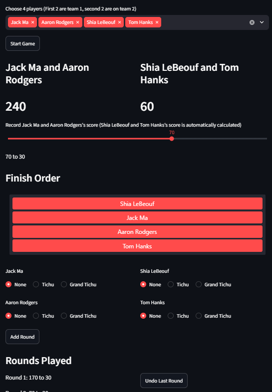
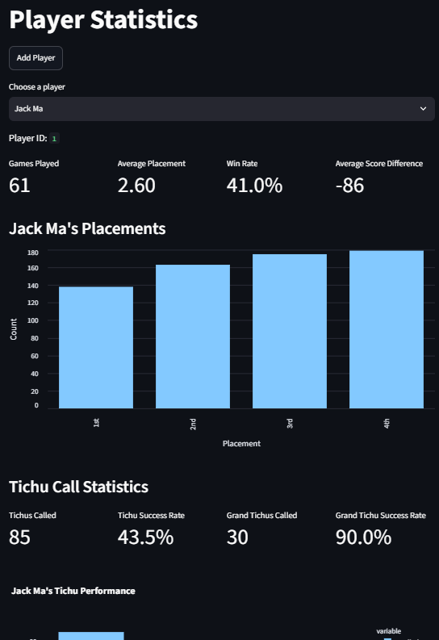
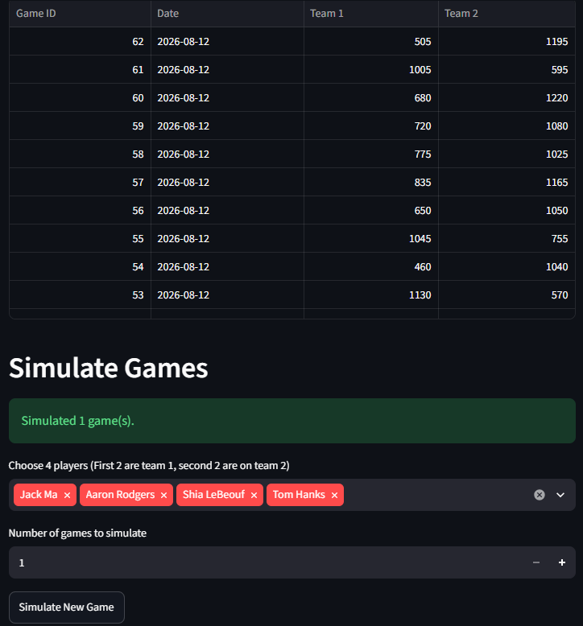

# TICHU SCOREKEEPER

A Python/Streamlit application for recording, storing, and analyzing games of Tichu.

## Features

- Record complete Tichu games through a web interface
- Track team scores and 1–2 finishes
- Record Tichu and Grand Tichu calls and outcomes
- Track individual player placements
- Store game, round, player, placement, and call data in SQLite
- View historical games
- View individual player statistics
- Visualize player performance
- Simulate games with randomly generated results for testing and analysis
- Undo incorrectly entered rounds
- Add and manage players

## Technologies

- Python
- Streamlit
- SQLite
- Pandas
- Plotly

## How It Works

The application uses object-oriented Python classes to represent players, rounds, and games. Game data is stored in a relational SQLite database.

The database separates games, rounds, players, teams, placements, and Tichu calls so that the collected data can later be queried for analysis.

The application also includes a game simulator that generates random games, allowing the database and analytical features to be tested with large amounts of data.

## Screenshots

### Scorekeeper

### Player Statistics

### Game History

## Analysis

- Tichu success rates
- Grand Tichu success rates
- Average placement
- Win rate
- 1–2 performance
- Average score difference

## Development Journal
### 7.31
I created the program and set up a file structure. Then I built a simulator that can play a full game of tichu (based on random results) and collect data. 

### 8.4
Changed the TichuGame class to accept a Round class instead of a lot of variables. Improved the Player() class and underlying logic to better record statistics. Improved debugging by adding __str__ attributes to each class.

### 8.5
Made a function to store player data in SQLite database. Learned how to use SQLite. Added ability to store game data.

### 8.6
Encountered numerous bugs saving the different data into SQLite using object-oriented programming. Debugged a few things, like player_id not storing correctly, and now everything is being stored properly. Can begin with web app. Made a framework for the website, but website still non-functional. 

### 8.7
Created the widgets for all necessary parts of the scorekeeper. It still does not store data accurately, but I debugged several issues that came up, researching more about Streamlit. 

Significantly improved streamlit interface. Created sortable list for turn order, showed updated score, and accurately tracked the game. Still need to store data in database accurately.

### 8.11
The round scoring had numerous bugs, so I debugged round storage logic, such as player objects not matching up because of 'list inside a list' error. Upgraded web app and created statistics and new pages for the app. It is now nearly complete. At this point it is mostly repetitive, just pulling different data out of the database to make stats with. Ran into issues because of nothing to record the teams players were on, so I deleted my database and made a new table with that information.

### 8.12
Added in several features, like the ability to simulate games on the website, an undo button, and an add player function. Deployed website.

## Future Work

- Add more advanced statistical analysis
- Analyze relationships between Tichu calls, placements, and game outcomes
- Improve data visualization
- Move data storage to external database